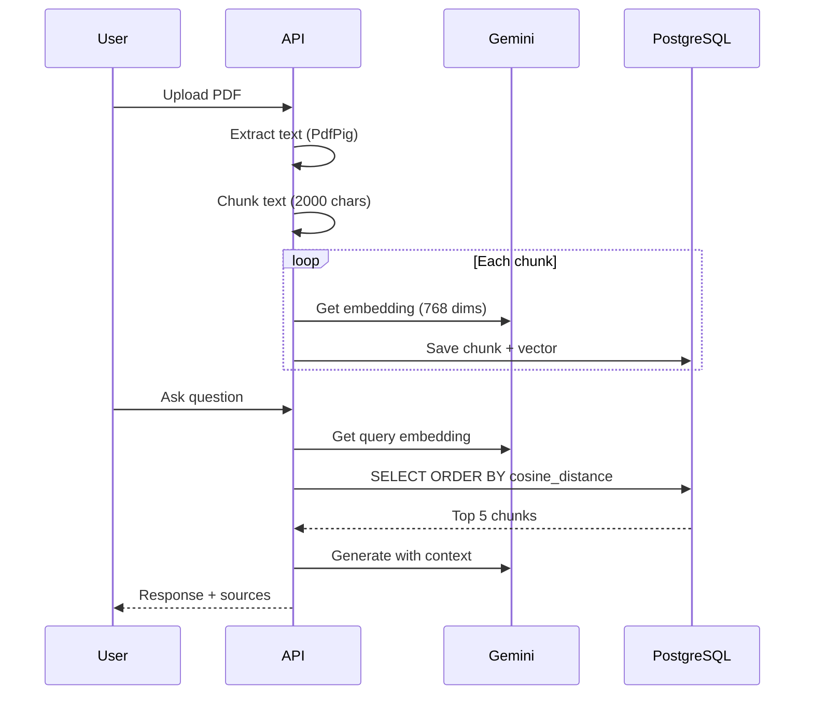

# InvestmentHub - AI/RAG Module - Learning Doc

> [!NOTE]
> Moduł AI Financial Analyst - analiza raportów finansowych z użyciem RAG (Retrieval-Augmented Generation).

---

## Spis treści

1. [RAG - Retrieval-Augmented Generation](#1-rag)
2. [Vector Embeddings](#2-vector-embeddings)
3. [pgvector - PostgreSQL Extension](#3-pgvector)
4. [Gemini API Integration](#4-gemini-api)
5. [Document Processing Pipeline](#5-document-processing)
6. [Background Processing Patterns](#6-background-processing)
7. [Pytania rekrutacyjne AI/ML](#7-pytania-rekrutacyjne)

---

## 1. RAG

### Co to jest?

**RAG (Retrieval-Augmented Generation)** - wzorzec AI łączący wyszukiwanie z generowaniem tekstu.

```
┌─────────────────────────────────────────────────────────────┐
│                     RAG Pipeline                            │
├──────────────┬──────────────────┬──────────────────────────┤
│  Retrieval   │   Augmentation   │       Generation         │
│ (Wyszukaj)   │   (Dodaj do     │  (Generuj odpowiedź)     │
│              │    promptu)      │                          │
└──────────────┴──────────────────┴──────────────────────────┘
```

### Dlaczego RAG zamiast "czystego" LLM?

| Problem LLM | Rozwiązanie RAG |
|-------------|-----------------|
| Halucynacje (wymyślanie) | Odpowiedź tylko z kontekstu |
| Brak aktualnych danych | Wyszukiwanie w dokumentach |
| Brak specjalizacji | Własne dokumenty domeny |
| Kosztowe fine-tuning | Tanie embeddings |

### Przepływ w projekcie



---

## 2. Vector Embeddings

### Co to jest?

**Embedding** to reprezentacja tekstu jako wektor liczb (np. 768 wymiarów). Podobne znaczeniowo teksty mają podobne wektory.

```
"Apple stock price"  →  [0.12, -0.34, 0.56, ...]  (768 dims)
"AAPL share value"   →  [0.11, -0.32, 0.58, ...]  (bardzo podobne!)
"Cat sleeping"       →  [0.89, 0.12, -0.45, ...]  (zupełnie inne)
```

### Cosine Similarity

Miara podobieństwa wektorów - kąt między nimi.

```
Cosine Similarity = (A · B) / (||A|| × ||B||)

Wartość:
- 1.0 = identyczne kierunki (identical meaning)
- 0.0 = prostopadłe (unrelated)
- -1.0 = przeciwne (opposite meaning)
```

**pgvector używa Cosine Distance = 1 - Cosine Similarity** (im mniejsza wartość, tym bardziej podobne).

### Implementacja

```csharp
// GeminiService.cs
public async Task<float[]> GetEmbeddingAsync(string text, CancellationToken ct)
{
    var request = new
    {
        model = "models/text-embedding-004",
        content = new { parts = new[] { new { text } } }
    };

    var response = await _httpClient.PostAsJsonAsync(
        $"v1beta/models/text-embedding-004:embedContent?key={_apiKey}",
        request, ct);

    var result = await response.Content.ReadFromJsonAsync<EmbeddingResponse>(ct);
    return result?.Embedding?.Values ?? Array.Empty<float>();  // 768 floats
}
```

---

## 3. pgvector

### Co to jest?

**pgvector** - extension PostgreSQL do przechowywania i wyszukiwania wektorów.

### Dlaczego pgvector zamiast dedykowanej bazy?

| pgvector | Pinecone/Weaviate |
|----------|-------------------|
| ✅ Już masz PostgreSQL | ❌ Nowa infrastruktura |
| ✅ Transakcje atomowe | ❌ Eventual consistency |
| ✅ Zero kosztów extra | ❌ Płatne |
| ✅ EF Core integration | ❌ Osobne SDK |
| ⚠️ Single node | ✅ Skalowalne |

### Konfiguracja EF Core

```csharp
// Program.cs
builder.AddNpgsqlDbContext<ApplicationDbContext>("postgres", options =>
{
    options.UseNpgsql(npgsqlOptions =>
    {
        npgsqlOptions.UseVector();  // Włącza pgvector
    });
});
```

### Entity z Vector

```csharp
public class DocumentChunk
{
    public Guid Id { get; set; }
    public Guid ReportId { get; set; }
    public string Content { get; set; }
    public Vector Embedding { get; set; }  // pgvector type
    public int? PageNumber { get; set; }
}
```

### Vector Search Query

```csharp
public async Task<List<SearchResult>> SearchAsync(string query, int topK = 5)
{
    var queryEmbedding = await _gemini.GetEmbeddingAsync(query);
    var vector = new Vector(queryEmbedding);

    return await _db.DocumentChunks
        .Where(c => c.Report.Status == ReportStatus.Ready)
        .OrderBy(c => c.Embedding.CosineDistance(vector))  // <== pgvector!
        .Take(topK)
        .Select(c => new SearchResult { Content = c.Content })
        .ToListAsync();
}
```

### SQL wygenerowany

```sql
SELECT d."Content" FROM "DocumentChunks" d
INNER JOIN "FinancialReports" f ON d."ReportId" = f."Id"
WHERE f."Status" = 'Ready'
ORDER BY d."Embedding" <=> @queryVector  -- Cosine distance operator
LIMIT 5
```

**Operators pgvector:**
- `<=>` - Cosine distance
- `<->` - Euclidean distance (L2)
- `<#>` - Inner product

---

## 4. Gemini API

### Modele

| Model | Użycie | Limit (free) |
|-------|--------|--------------|
| `text-embedding-004` | Embeddings (768 dims) | 15 RPM |
| `gemini-2.5-flash` | Chat/Generation | 5 RPM |

### Retry Pattern dla Rate Limits

```csharp
public async Task<string> GenerateResponseAsync(string prompt, string context)
{
    const int maxRetries = 3;
    
    for (int attempt = 0; attempt < maxRetries; attempt++)
    {
        var response = await _httpClient.PostAsJsonAsync(url, request);

        // Handle 429 Too Many Requests
        if ((int)response.StatusCode == 429)
        {
            var waitTime = (attempt + 1) * 15000;  // 15s, 30s, 45s
            _logger.LogWarning("Rate limited, waiting {Wait}ms", waitTime);
            await Task.Delay(waitTime);
            continue;
        }
        
        response.EnsureSuccessStatusCode();
        return ParseResponse(response);
    }
    
    return "Rate limit exceeded. Please try again.";
}
```

### System Prompt dla RAG

```csharp
var systemPrompt = $"""
    You are a financial analyst assistant.
    Answer based ONLY on provided context.
    If not in context, say "I don't have that information."
    
    Context from financial documents:
    {context}
    """;
```

---

## 5. Document Processing

### PDF Text Extraction (PdfPig)

```csharp
private (string fullText, Dictionary<int, string> pageTexts) ExtractTextFromPdf(Stream pdfStream)
{
    using var document = PdfDocument.Open(pdfStream);
    var fullText = new StringBuilder();
    var pageTexts = new Dictionary<int, string>();

    foreach (var page in document.GetPages())
    {
        var pageText = page.Text;
        pageTexts[page.Number] = pageText;
        fullText.AppendLine(pageText);
    }

    return (fullText.ToString(), pageTexts);
}
```

### Chunking Strategy

```csharp
private const int MaxChunkSize = 2000;  // ~500 tokens
private const int ChunkOverlap = 200;   // Context continuity

private List<string> ChunkText(string text, int maxSize, int overlap)
{
    var chunks = new List<string>();
    var sentences = text.Split(new[] { ". ", ".\n" }, StringSplitOptions.RemoveEmptyEntries);
    
    var currentChunk = new StringBuilder();
    var previousSentences = new Queue<string>();
    
    foreach (var sentence in sentences)
    {
        if (currentChunk.Length + sentence.Length > maxSize && currentChunk.Length > 0)
        {
            chunks.Add(currentChunk.ToString());
            
            // Overlap - dodaj poprzednie zdania do nowego chunka
            currentChunk.Clear();
            foreach (var prev in previousSentences)
                currentChunk.Append(prev).Append(". ");
        }
        
        currentChunk.Append(sentence).Append(". ");
        previousSentences.Enqueue(sentence);
        if (previousSentences.Count > 3)
            previousSentences.Dequeue();
    }
    
    return chunks;
}
```

**Dlaczego overlap?**
- Zdania na granicach chunków są w obu
- Wyszukiwanie nie traci kontekstu

---

## 6. Background Processing

### Problem: Scoped DbContext

```csharp
// ❌ ŹLEL - DbContext będzie disposed po response
[HttpPost("upload")]
public async Task<IActionResult> Upload(IFormFile file)
{
    _db.Reports.Add(report);
    await _db.SaveChangesAsync();
    
    _ = Task.Run(async () => {
        await _documentProcessor.ProcessAsync(report.Id, file.OpenReadStream());
        // DbContext już disposed! 💥
    });
    
    return Ok();
}
```

### Rozwiązanie: IServiceScopeFactory

```csharp
// ✅ DOBRZE
[HttpPost("upload")]
public async Task<IActionResult> Upload(IFormFile file, 
    [FromServices] IServiceScopeFactory scopeFactory)
{
    // 1. Kopiuj plik do pamięci PRZED response
    var memoryStream = new MemoryStream();
    await file.CopyToAsync(memoryStream);
    memoryStream.Position = 0;
    
    // 2. Zapisz do DB
    _db.Reports.Add(report);
    await _db.SaveChangesAsync();
    var reportId = report.Id;
    
    // 3. Background task z NOWYM scope
    _ = Task.Run(async () => {
        using var scope = scopeFactory.CreateScope();
        var processor = scope.ServiceProvider.GetRequiredService<DocumentProcessor>();
        await processor.ProcessAsync(reportId, memoryStream);
    });
    
    return Ok();
}
```

**Kluczowe punkty:**
1. Kopiuj plik **przed** zwróceniem response
2. Twórz **nowy scope** w background task
3. Resolve services **z nowego scope**

---

## 7. Pytania rekrutacyjne

### Co to RAG i kiedy stosować?

**A**: RAG łączy wyszukiwanie z generowaniem. Używam gdy:
- LLM nie ma dostępu do moich danych
- Potrzebuję cytować źródła
- Chcę uniknąć halucynacji
- Fine-tuning jest zbyt drogi

### Jak działa semantic search?

**A**: 
1. Tekst → embedding (wektor 768 dim)
2. Wyszukiwanie = porównanie odległości wektorów
3. Cosine distance - im mniejsza, tym bardziej podobne znaczeniowo

### Dlaczego chunking z overlap?

**A**: Overlap zapewnia że kontekst nie jest tracony na granicach. Zdanie przecięte przez granicę będzie w obu chunkach.

### pgvector vs Pinecone?

**A**: pgvector gdy:
- Już masz PostgreSQL
- Potrzebujesz transakcji atomowych
- Nie masz milionów wektorów
- Chcesz uniknąć kosztów

Pinecone gdy:
- Potrzebujesz ekstremalnej skalowalności
- Masz miliardy wektorów

### Background processing + DbContext?

**A**: DbContext jest scoped. W background task:
1. Kopiuj dane przed response
2. Użyj IServiceScopeFactory
3. Resolve z nowego scope

### Rate limiting w external APIs?

**A**: 
- Retry z exponential backoff
- Graceful degradation
- Queue/batch requests
- Monitor i alerting

---

## Pliki źródłowe

- [GeminiService.cs](file:///d:/Github/InvestmentHub/src/InvestmentHub.Infrastructure/AI/GeminiService.cs)
- [DocumentProcessor.cs](file:///d:/Github/InvestmentHub/src/InvestmentHub.Infrastructure/AI/DocumentProcessor.cs)
- [VectorSearchService.cs](file:///d:/Github/InvestmentHub/src/InvestmentHub.Infrastructure/AI/VectorSearchService.cs)
- [AIController.cs](file:///d:/Github/InvestmentHub/src/InvestmentHub.API/Controllers/AIController.cs)

---

> [!TIP]
> Praktyczne doświadczenie z RAG, pgvector i Gemini API to świetny punkt na rozmowach o ML/AI integration w .NET.
