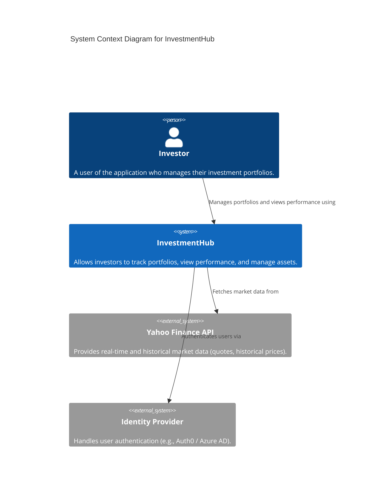

# InvestmentHub - Architecture Overview

This document provides a high-level overview of the current architecture of the InvestmentHub system.

## C4 Model - Context Diagram (Level 1)

The following diagram shows the system in its environment, including the primary users and external systems.

## Core Patterns (.NET 9 Backend)

The backend application is built upon the following patterns and technologies:

1. **CQRS (Command Query Responsibility Segregation):**
   * Utilizing the `MediatR` library to separate write logic (Commands) from read logic (Queries).
2. **Clean Architecture / Modular Monolith:**
   * The project is divided into layers: `API`, `Application`, `Domain`, `Infrastructure`, `Contracts`.
3. **Event Sourcing (for specific modules):**
   * Using the `Marten` library on top of PostgreSQL to save state changes as a sequence of Events.
4. **Asynchronous Processing (Background Jobs & Messaging):**
   * `MassTransit` with `RabbitMQ` for message-based communication.
   * `Hangfire` for background jobs and scheduled workers.

## Frontend (React / Next.js)

The primary user interface is built on a modern stack:
* **Next.js 16** with React 19 (App Router).
* State management: **Zustand** (client state) and **TanStack Query** (server state/cache).
* UI based on **TailwindCSS 4** and **shadcn/ui**.

## Infrastructure

The system is designed to run in a distributed environment (Docker, Azure Container Apps), and local development is orchestrated by **.NET Aspire**.
